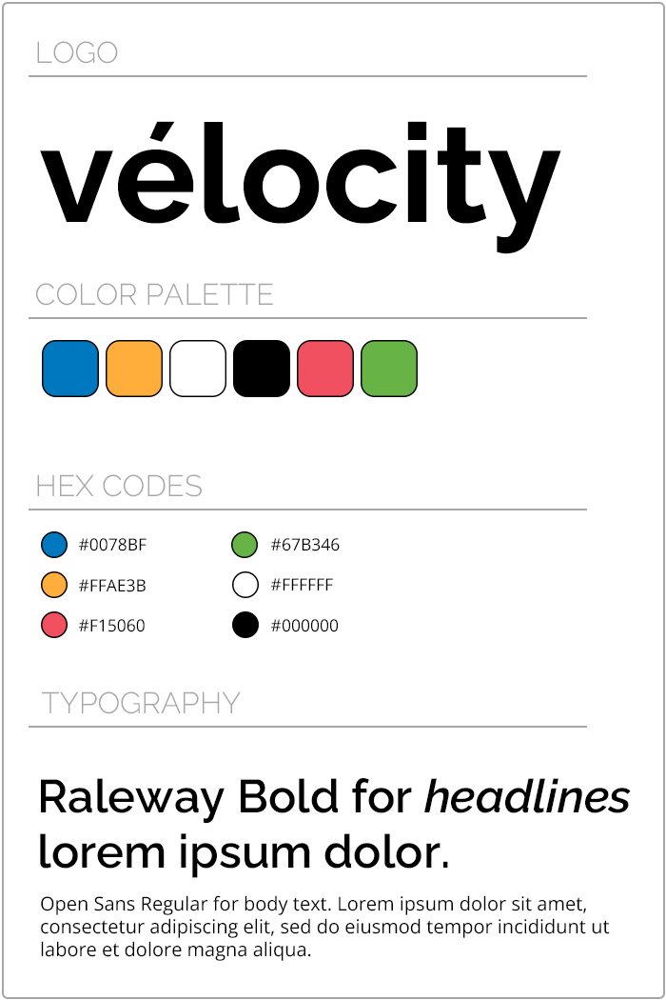

<!--  -->

## Vélocity

**Vélocity helps customers & bicycle providers streamline their experience & access to city wide bike-sharing networks.**

Vélocity aims to:

-   **Dynamically monitor** and **readily manage** bike-sharing locations and availability with up-to-date analytics.
-   **Streamline inventory tracking processes** for bicycle provider administrators.
-   **Report losses and damages** for both administrator and customers quickly and easily without hassle.

## Brand Guidelines



## Installation

### React: Bootstrap

```sh
npm i react-router-dom bootstrap react-bootstrap
```

### MUI: Material UI

```sh
npm i @mui/material @mui/icons-material @emotion/styled @emotion/react
```

## Logo

### Wide Text


### Standard Round


## Acknowledgements

Developed by Lara de Castro Mauricio, Ruben Arturo Perez Juarez, Charles Bourassa, & Julien Lafontaine for McGill YCIT 099 Full Stack Javascript Capstone Project.
